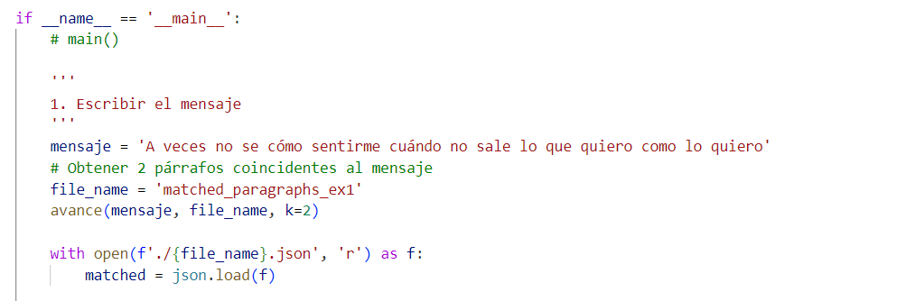

# Proyecto_PreTAWS_G4

# Instalar requirements

`pip install -r requirements.txt`

# En app.py

**1. Ingresar el mensaje en `mensaje`**



**2. Ejecutar app.py**
Ejecutar en el terminal al archivo app.py

`python app.py`

**3. Leer el archivo json generado**
Este archivo contiene los párrafos que tienen similitud con el mensaje propuesto en `mensaje`.
Este archivo tiene la siguiente estructura
```javascript
{'mensaje':
        [
            {
                'podcast':'nombre_del_podcast',
                'title':'titulo_del_episodio_del_podcast',
                'matched_paragraphs':['texto_primer_parrafo', 
                                        'texto_segundo_parrafo',
                                          ...,
                                            'texto_k-ésimo párrafo']
            },
            {...},
            ...,
            {...}
        ]
    }
```